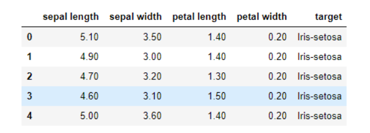
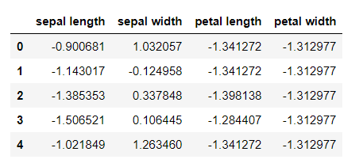
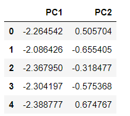

# PCA (주성분 분석)


### PCA (주성분 분석) 이란?

고차원의 데이터를 저차원의 데이터로 압축시키는 기법이다.

차원을 감소시켜 해석을 용이하게 하고 시각화가 가능해지게 한다.
<br/>

------

<br/>

### 주성분이란?


```python

import pandas as pd
url = "https://archive.ics.uci.edu/ml/machine-learning-databases/iris/iris.data"
df = pd.read_csv(url, names=['sepal length','sepal width','petal length','petal width','target'])
df.head()

```

예를들어, 다음의 iris data가 있다고 하자.





iris data set 에서 앞의 4가지 변수 (sepal length, sepal width, petal length, petal width)는 독립 변수이고 target은 종속 변수이다.

  

**"*<u>그럼, 2개의 변수로도 4개의(전체) 변수의 분산에 대해 설명할수 있지 않을까?</u>*  "**


라고 생각할 수 있다.

주성분이란 전체 데이터(독립변수들)의 분산을 가장 잘 설명하는 성분이라고 할 수 있다. 

하나의 변수는 하나의 차원을 의미한다. 

iris data를 예로 들자면,  4개의 독립변인들이 하나의 공간에 표현되기 위해서는 그 공간이 4차원이어야 한다. 

차원이 증가할수록 데이터가 표현해야 하는 공간은 복잡해진다.  그렇기 때문에 차원 축소를 해야한다. 

즉, PCA 의 본질은 차원 축소이다.


<br/>


------


<br/>


### 표준화란?

PCA (주성분 분석)를 진행하기전에 데이터의 표준화를 진행해야 하는데 여기서 표준화란 데이터의 값의 '단위' 및 '크기'에 따라서 데이터의 분산량이 왜곡될 수 있기 때문에 모두 단위 분산은 갖게 만든다는 의미이다.


#### 파이썬 코드

```python

from sklearn.preprocessing import StandardScaler  

x = df.drop(['target'], axis=1).values # 독립 변수들의 value값 추출한다.
y = df['target'].values # 종속 변수의 value값 추출한다.

x = StandardScaler().fit_transform(x) # x에 x데이터들을 표준화한 데이터를 저장한다.

features = ['sepal length', 'sepal width', 'petal length', 'petal width']
pd.DataFrame(x, columns=features).head()


```


-  sklearn.preprocessing : scikit-learn이란 python을 대표하는 머신러닝 라이브러리이고 이 라이브러리의 전처리 기능 중 하나인 preprocessing을 사용한다. 
- standardscaler() : 각 특성의 평균을 0, 분산을 1로 스케일링하여 데이터를 정규분포로 만든다.


#### 결과

이렇게 표준화된 값을 볼 수 있다.




------


### PCA (주성분 분석) 실행


#### 파이썬 코드

```python

from sklearn.decomposition import PCA 
pca = PCA(n_components=2) # 주성분을 2개로 한다.
PC = pca.fit_transform(x) 
PCdf = pd.DataFrame(data=printcipalComponents, columns = ['PC1', 'PC2'])
PCdf.head()

```


#### 결과

주성분으로 이루어진 데이터 프레임 결과를 얻었다.




