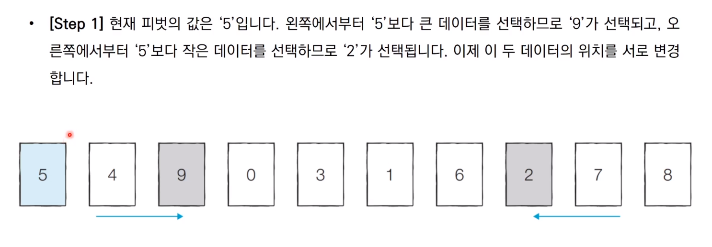

# Quick Sort (퀵 정렬)


###  Quick Sort (퀵 정렬) 이란?

- 기준 값(pivot)을 중심으로 작은 원소들은 왼쪽 부분집합으로, 큰 원소들은 오른쪽 부분집합으로 분할하여 정렬하는 방식의 알고리즘이다. 
- 다른 정렬 알고리즘보다 훨씬 빠른 속도로 정렬을 해주는 알고리즘이다.
- 퀵 정렬은 분할 정복 (divide and conquer) 방법을 사용하는 알고리즘 중 하나인데 분학 정복이란 작은 2개로 분리하고 각각 해결한 다음 이를 합쳐서 원래의 문제를 해결하는 방법이다.

------


## 예시





------


### 파이썬 코드

```python

def quick_sort(list): # quick_sort 함수를 만들고 인자로 list를 받는다.
    if len(list) <= 1:  # 만약에 list의 길이가 1보다 작거나 같으면 list를 반환시킨다.
        return list
    pivot = list[0]  # pivot 값은 임의로 제일 앞에 있는 숫자로 정한다.
    
    less = [] # pivot을 기준으로 작은 값들을 넣는다.
    equal = [] # pivot이랑 같은 값, 즉 pivot 값을 넣는다.
    bigger = [] # pivot을 기준으로 큰 값들을 넣는다.
    
    for i in list:   # 반복문을 돌면서 pivot 기준 작은 값은 왼쪽, 큰 값은 오른쪽으로 이동시켜준다. 
        if i < pivot:
            less.append(i)
        elif i > pivot:
            bigger.append(i)
        else: 
            equal.append(i)
    # less, equl, bigger 안에 들어있는 값들도 quick_sort를 돌려서 결과값들을 합쳐서 결과를 보여준다.
    return  quick_sort(less) + quick_sort(equal) + quick_sort(bigger)

```


```python

list = [14, 5, 8, 9, 15, 4, 13, 10, 12]
print(quick_sort(list))

```


### 결과

```python

[4, 5, 8, 9, 10, 12, 13, 14, 15]

```

