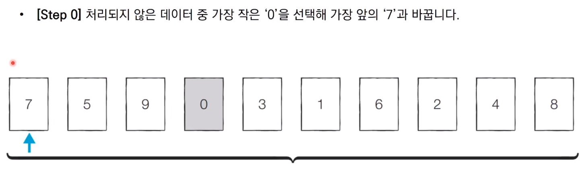
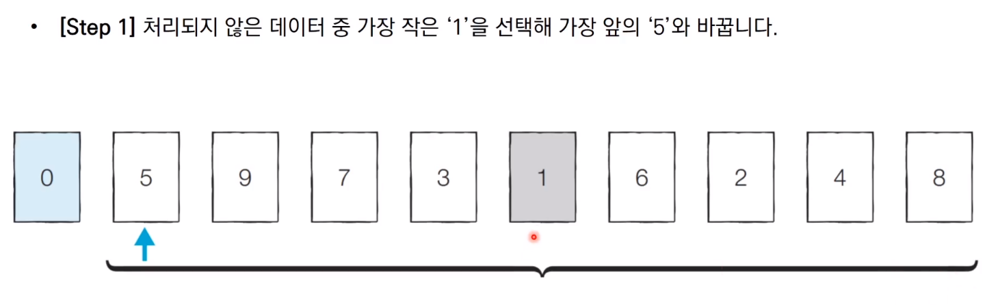
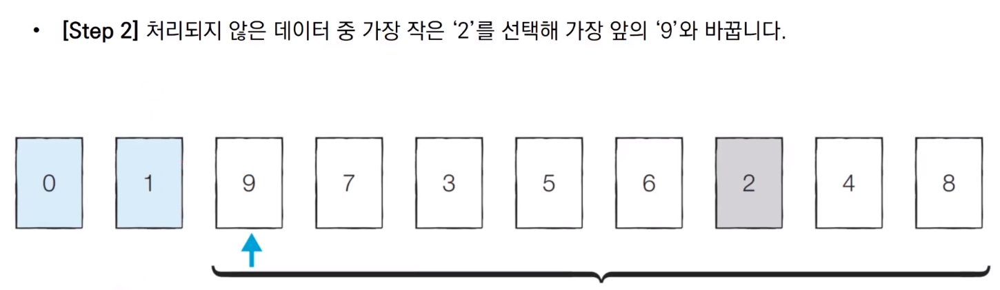

# Selected Sort (선택정렬)

- 처리되지 않은 데이터 중에서 가장 작은 데이터를 선택해 맨 앞에 있는 데이터와 바꾸는 것을 반복하는 정렬


### 예시











### 파이썬 코드

```python

array = [7, 5, 9, 0, 3, 1, 6, 2, 4, 8]

for i in range(array):
    min_index = i # 가장 작은 원소의 인덱스
    for j in range(i+1, len(array)):
        if min_index[i] > array[j]:
            min_index = j
    array[i], array[min_index] = array[min_index], array[i] # 스와프
    print(array)
    
```


### 결과

```python

[0, 1, 2, 3, 4, 5, 6, 7, 8, 9]

```

