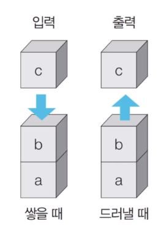

# Stack(스택)

### Stack 자료구조

- 먼저 들어 온 데이터가 나중에 나가는 형식

- 입구와 출구가 동일한 형태로 스택을 시각화 할 수 있다.

  



#### 예시

삽입(1) - 삽입(2) - 삽입(3) - 삭제()


empty stack에 삽입(1) - 삽입(2) - 삽입(3) 하고 삭제() 하면 제일 마지막에 들어온 3이 나간다.


### Python Code

```python
# 삽입(9)-삽입(2)-삽입(5)-삽입(7)-삭제()-삽입(6)-삽입(2)-삭제()

stack = []

stack.append(9) # append로 원소 삽입
stack.append(2)
stack.append(5)
stack.append(7)
stack.pop() # pop으로 원소 삭제
stack.append(6)
stack.append(2)
stack.pop()

```


최하단(제일 밑에) 원소부터 출력

#### 출력 #1

```python
print(stack)
```

#### 결과

````
[9, 2, 5, 6]
````


최상단(제일 위에) 원소부터 출력

#### 출력 #2

```python
print(stack[::-1])
```

- **stack [start : stop : step]**
- start를 입력하지 않으면 0을 입력한 것과 같다.
- stop을 입력하지 않으면 리스트의 길이 `len(stack)`을 입력한 것과 같다.
- step을 입력하지 않으면 1을 입력한 것과 같다.

#### 결과

````python
[6, 5, 2, 9]
````


