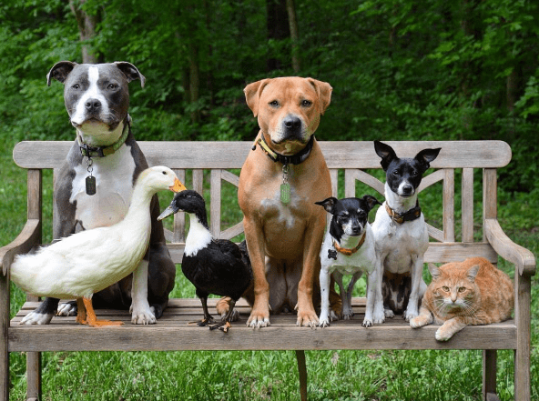
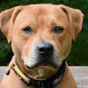
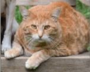

# 사진 자르고 저장하기 (Crop Image)





이렇게 동물들 사진이 있다. 

여기서 중간에 있는 브라운색 강아지 얼굴이랑 제일 오른쪽에 있는 고양이 얼굴을 잘라서 .png 파일로 저장해보려고 한다.


## opencv-python 패키지 

opencv-python 패키지는 영상처리 및 컴퓨터비전에 관한 대표적이 패키지이다. 단일 이미지나 동영상의 이미지를 원하는 결과를 분석및 추출하기 위해 사용된다. 사진을 자르고 저장하기 위해서 이 패키지를 사용한다.

------


## 함수들

- `cv2.imread()` :  이미지 파일을 읽을때 사용
  	- `cv2.imread_color` : 컬러 이미지를 읽을때 사용
  	- `cv2.imread_grayscale` : 이미지를 grayscale로 읽을때 사용
  	- `cv2.imread_unchanged` : 이미지를 있는 그대로 읽을때 사용
 - `cv2.imshow()` : 이미지를 사이즈게 맞게 보여줄때 사용
    - `cv2.waitKey(0)` 와 `cv2.destroyAllWindows()` 와 같이 사용한다.
    - `cv2.waitKey(0)` : 키입력을 대기하는 함수로 0이면 키입력까지 무한대기이며 특정 시간동안 대기하려면 값을 넣어주면 된다.
      	- `cv2.destroyAllWindows()` : 화면에 나타난 윈도우를 종료한다.
	- `cv2.imwrite()` : 변환된 이미지나 동영상을 저장할때 사용

------


## 파이썬 코드

### 출력 #1

중간에 브라운색 강아지 얼굴만 자르기

```python

import cv2

src = cv2.imread('./data3.png', cv2.IMREAD_UNCHANGED)
src_face = src[80:180, 270:370] # 자를 부분(강아지얼굴)의 좌표 값
cv2.imshow('Image',src_face)

cv2.imwrite('./dog.png',src_face)
cv2.waitKey(0)
cv2.destroyAllWindows()

```


### 결과 #1

밑에 사진처럼 브라운색 강아지 얼굴만 잘라진 dog.png 파일이 만들어져서 저장이 되었다. 





------


### 출력 #2

제일 오른쪽에 있는 고양이 자르기

```python

import cv2

src = cv2.imread('./data3.png', cv2.IMREAD_UNCHANGED)
src_face1 = src[280:380, 445:565]
cv2.imshow('Image',src_face1)

cv2.imwrite('./cat.png',src_face1)
cv2.waitKey(0)
cv2.destroyAllWindows()

```


### 결과 #2

밑에 사진처럼 고양이 얼굴만 잘라진 cat.png 파일이 만들어져서 저장이 되었다. 


